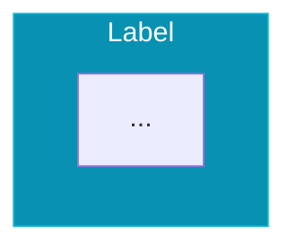

# Design Context - ITBID Technical Document

## Brand Identity

### ITBID Brand Colors (HSL Format)

| Color Name | HSL Value | Usage |
|------------|-----------|-------|
| **Cyan** | `187 100% 42%` | Primary accent, CTAs, links, icons |
| **Magenta** | `340 82% 52%` | Secondary accent, highlights, badges |
| **Lime** | `66 68% 54%` | Success states, positive indicators |
| **Purple** | `262 52% 47%` | Tertiary accent |
| **Navy** | `210 50% 24%` | Dark backgrounds |

### Usage in Components

```css
/* Primary elements */
.primary-bg { background-color: hsl(var(--itbid-cyan)); }
.primary-text { color: hsl(var(--itbid-cyan)); }
.primary-border { border-color: hsl(var(--itbid-cyan)/0.3); }

/* With opacity */
.primary-subtle { background-color: hsl(var(--itbid-cyan)/0.1); }
```

## Design Patterns

### 1. Section Headers
Each section follows this pattern:
- Badge with icon and section number
- Large bold title (3xl-4xl)
- Subtitle in muted color
- Max width 3xl for paragraph text

```tsx
<Badge className="mb-4 bg-[hsl(var(--itbid-cyan)/0.1)] text-[hsl(var(--itbid-cyan))] border-[hsl(var(--itbid-cyan)/0.3)]">
  <Icon className="h-3 w-3 mr-1" />
  Sección X
</Badge>
<h2 className="text-3xl md:text-4xl font-bold mb-4">Title</h2>
<p className="text-lg text-muted-foreground max-w-3xl mx-auto">...</p>
```

### 2. Card with Colored Border Top
Used for feature cards:
```tsx
<Card 
  className="hover:shadow-lg transition-shadow border-t-4"
  style={{ borderTopColor: color }}
>
```

### 3. Icon Containers
Rounded squares with subtle background:
```tsx
<div className="w-12 h-12 rounded-xl bg-[hsl(var(--itbid-cyan)/0.1)] flex items-center justify-center">
  <Icon className="h-6 w-6 text-[hsl(var(--itbid-cyan))]" />
</div>
```

### 4. Gradient Backgrounds
Section backgrounds use subtle gradients:
```tsx
className="bg-gradient-to-br from-[hsl(var(--itbid-cyan)/0.1)] via-background to-[hsl(var(--itbid-magenta)/0.1)]"
```

### 5. Comparison Boxes
Side-by-side comparison with red (negative) and green (positive):
```tsx
// Negative/Traditional
<Card className="border-destructive/30 bg-destructive/5">
  <XCircle className="text-destructive" />
</Card>

// Positive/Modern
<Card className="border-[hsl(var(--itbid-lime)/0.3)] bg-[hsl(var(--itbid-lime)/0.05)]">
  <CheckCircle2 className="text-[hsl(var(--itbid-lime))]" />
</Card>
```

## Animation System

### FadeIn
Basic entrance animation:
```tsx
import { FadeIn } from "@/components/AnimatedSection";

<FadeIn delay={0.2}>
  <Content />
</FadeIn>
```

### StaggerContainer + StaggerItem
For lists that animate in sequence:
```tsx
import { StaggerContainer, StaggerItem } from "@/components/AnimatedSection";

<StaggerContainer className="grid md:grid-cols-3 gap-6">
  {items.map(item => (
    <StaggerItem key={item.id}>
      <ItemContent />
    </StaggerItem>
  ))}
</StaggerContainer>
```

### Motion div
Direct framer-motion usage:
```tsx
<motion.div
  initial={{ opacity: 0, y: 20 }}
  whileInView={{ opacity: 1, y: 0 }}
  transition={{ delay: index * 0.1 }}
>
```

## Mermaid Diagrams

### Theme Support
Diagrams automatically switch between light/dark themes:
```tsx
<MermaidDiagram 
  chart={diagramCode} 
  scale={0.78}  // Adjust scale for size
  className="w-full" 
/>
```

### Diagram Styling
Mermaid diagrams use inline styles:


## Typography

### Headings
- **H1**: `text-4xl md:text-5xl lg:text-6xl font-bold`
- **H2**: `text-3xl md:text-4xl font-bold`
- **H3**: `text-xl md:text-2xl font-semibold`
- **H4**: `text-lg font-semibold`

### Body Text
- **Large**: `text-lg text-muted-foreground`
- **Normal**: `text-muted-foreground`
- **Small**: `text-sm text-muted-foreground`

### Badges
```tsx
<Badge className="bg-[hsl(var(--itbid-cyan)/0.1)] text-[hsl(var(--itbid-cyan))] border-[hsl(var(--itbid-cyan)/0.3)]">
```

## Responsive Design

### Breakpoints
- **sm**: 640px
- **md**: 768px
- **lg**: 1024px
- **xl**: 1280px

### Common Patterns
```tsx
// Grid columns
className="grid md:grid-cols-2 lg:grid-cols-3 gap-6"

// Show/hide
className="hidden md:block"
className="md:hidden"

// Font sizes
className="text-lg md:text-xl"
```

## Component Library

Uses **shadcn/ui** components:
- Card, CardHeader, CardTitle, CardContent
- Badge
- Button
- Table, TableHeader, TableBody, TableRow, TableCell, TableHead
- Dialog, DialogContent, DialogHeader, DialogTitle, DialogDescription
- Calendar
- RadioGroup, RadioGroupItem
- Label
- Progress

## Icons

Uses **Lucide React** icons:
```tsx
import { 
  Shield, Globe, FileText, Building2, 
  Target, Lightbulb, Handshake, TrendingUp,
  // ... more
} from "lucide-react";
```

## Dark Mode

All colors use CSS variables that adapt to theme:
- `text-foreground` / `text-muted-foreground`
- `bg-background` / `bg-muted`
- `border` / `bg-card`

The ITBID brand colors work in both modes due to their HSL alpha values:
```css
/* Works in light and dark */
background-color: hsl(var(--itbid-cyan)/0.1);
```
