# TeleNatura EBT - Design Context

## Identidad Visual

### Concepto de Diseño
TeleNatura EBT es una spin-off AgriTech especializada en agricultura de precisión, sensores IoT y soluciones data-driven para el sector agroalimentario. El diseño refleja:

- **Naturaleza**: Colores verdes, tierra y cielo
- **Tecnología**: Limpieza, precisión, modernidad
- **Confianza**: Profesionalismo y solidez
- **Sostenibilidad**: Certificaciones ecológicas

### Paleta de Colores

| Variable | HSL | Uso |
|----------|-----|-----|
| `--telenatura-green` | 142 71% 45% | Color primario, CTAs, acentos |
| `--telenatura-earth` | 28 55% 45% | Tierra, suelo, fundación |
| `--telenatura-sky` | 199 89% 48% | Cielo, tecnología, IoT |
| `--telenatura-leaf` | 84 68% 50% | Hojas, crecimiento, agricultura |
| `--telenatura-water` | 195 85% 41% | Agua, riego, eficiencia |
| `--telenatura-soil` | 24 38% 35% | Suelo oscuro, contraste |

### Gradientes

```css
/* Gradiente principal verde */
.telenatura-gradient {
  background: linear-gradient(to right, 
    hsl(142 71% 45%), 
    hsl(84 68% 50%)
  );
  -webkit-background-clip: text;
  -webkit-text-fill-color: transparent;
}

/* Gradiente tierra-verde */
.telenatura-gradient-earth {
  background: linear-gradient(to right, 
    hsl(28 55% 45%), 
    hsl(142 71% 45%)
  );
  -webkit-background-clip: text;
  -webkit-text-fill-color: transparent;
}
```

## Tipografía

### Fuentes
- **Display**: Inter (weight 300-700)
- **Body**: Inter o system-ui
- **Code**: JetBrains Mono (para snippets)

### Escala Tipográfica
- H1: 4xl-5xl (2.5-3rem) - Títulos de página
- H2: 3xl-4xl (1.875-2.25rem) - Títulos de sección
- H3: xl-2xl (1.25-1.5rem) - Subtítulos
- Body: base-lg (1-1.125rem) - Texto normal
- Small: sm-xs (0.875-0.75rem) - Captions, badges

## Componentes de Diseño

### Cards
```tsx
<Card className="h-full hover:shadow-lg transition-shadow">
  <CardHeader>
    <div className="w-12 h-12 rounded-xl bg-[hsl(var(--telenatura-green)/0.1)] flex items-center justify-center mb-4">
      <Icon className="h-6 w-6 text-[hsl(var(--telenatura-green))]" />
    </div>
    <CardTitle>Título</CardTitle>
  </CardHeader>
  <CardContent>
    <p className="text-muted-foreground">Contenido</p>
  </CardContent>
</Card>
```

### Badges
```tsx
<Badge className="bg-[hsl(var(--telenatura-green)/0.1)] text-[hsl(var(--telenatura-green))] border-[hsl(var(--telenatura-green)/0.3)]">
  Etiqueta
</Badge>
```

### Botones
```tsx
<Button className="bg-[hsl(var(--telenatura-green))] hover:bg-[hsl(var(--telenatura-green)/0.9)]">
  Acción Principal
</Button>
```

### Iconos
Se usa **Lucide React** para iconos. Iconos frecuentes:
- `Leaf`, `Sprout` - Agricultura
- `Droplets` - Agua, riego
- `Shield` - Seguridad, soberanía
- `Network` - Federación, conexión
- `Wifi` - IoT, sensores

## Patrones de Layout

### Hero Section
- Background con gradiente sutil
- Logos duales (PROCUREDATA × TeleNatura)
- Badge de proyecto
- Título con gradiente
- Métricas en grid de 3 columnas

### Content Sections
- Alternar entre `bg-background` y `bg-muted/30`
- Container con padding horizontal
- Títulos con badge de sección
- Grid responsive (1-2-3-4 columnas)

### Navigation
- Header sticky con backdrop-blur
- Sidebar fija en desktop
- Menú hamburguesa en móvil
- Scroll-to-top button

## Animaciones

### Framer Motion
```tsx
<motion.div
  initial={{ opacity: 0, y: 20 }}
  whileInView={{ opacity: 1, y: 0 }}
  viewport={{ once: true }}
  transition={{ delay: index * 0.1 }}
>
  {/* Contenido */}
</motion.div>
```

### Transiciones CSS
- `transition-shadow` para hover en cards
- `transition-colors` para hover en botones
- `transition-transform` para efectos de escala

## Diagramas Mermaid

### Estilo de Diagramas

```mermaid
graph TB
    subgraph GROUP["🌾 Título del Grupo"]
        NODE["📡 Nombre<br/>(Descripción)"]
    end
    
    style GROUP fill:#f0fdf4,stroke:#22c55e
```


### Colores de Grupos
- Campo/Agricultura: `#f0fdf4` (verde claro)
- Infraestructura: `#ecfeff` (azul claro)
- Conectores: `#fef3c7` (amarillo claro)
- Core: `#ede9fe` (púrpura claro)

## Contexto de Negocio

### Sector
Agricultura de precisión, AgriTech, sostenibilidad agrícola

### Audiencia
- Agricultores y cooperativas
- Técnicos agrícolas
- Entidades certificadoras
- Comunidades de regantes

### Propuesta de Valor
"Espacio de datos federado donde el agricultor mantiene el control total de sus datos mientras accede a los beneficios de la agricultura de precisión"

### Mensajes Clave
1. **Soberanía**: "Tu dato, tu control"
2. **Eficiencia**: "-40% consumo de agua"
3. **Trazabilidad**: "Del campo al plato"
4. **Sostenibilidad**: "Certificación automática"

---

© 2025 TeleNatura EBT × PROCUREDATA
